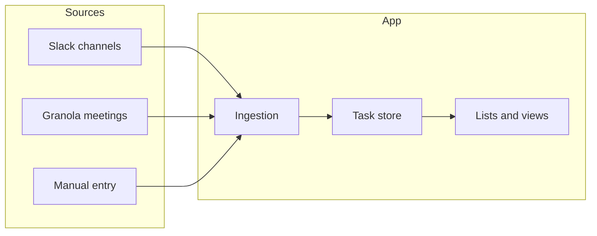

# PRD: Personal Task Commitments App

## Purpose of the PRD

You asked for a **PRD** (Product Requirements Document) that acts as a “perfect product management assistant.” This plan defines the structure and content of that PRD so it is clear, actionable, and suitable for you to build from or to brief a contractor. The PRD will be a single markdown document (e.g. `PRD.md`) in your To Do App workspace.

---

## 1. PRD structure and sections

The PRD will include these sections:

| Section                            | Purpose                                                                                                              |
| ---------------------------------- | -------------------------------------------------------------------------------------------------------------------- |
| **Problem statement**              | Pain: handwritten lists, tasks from Slack + meetings + ideas, list overflow, lost items, poor prioritization.        |
| **Goals and success criteria**     | What “done” looks like (e.g. one place for all commitments, clear priorities, completion tracking, weekly planning). |
| **User persona and context**       | Busy PM, single user; tasks from Slack, Granola meetings, and manual capture.                                        |
| **Data sources and ingestion**     | How tasks enter the system: Slack (daily scan), Granola (meeting transcripts/notes), manual entry.                   |
| **Core features and requirements** | Lists, categorization, prioritization/re-prioritization, completion, day/week views.                                 |
| **User flows**                     | Morning review, adding/categorizing/prioritizing, completing, planning week.                                         |
| **Non-functional requirements**    | Performance, data ownership, security (single user).                                                                 |
| **Platform recommendation**        | Web-first with optional PWA; rationale.                                                                              |
| **Out of scope / v2**              | What is explicitly deferred.                                                                                         |
| **Appendix**                       | Optional: glossary, reference to Slack/Granola APIs.                                                                 |

---

## 2. Problem statement (to be written in PRD)

- **Current behaviour**: Capturing commitments in notepad from meetings, Slack, and own ideas; lists grow beyond a page; items get lost across pages; hard to prioritise and re-prioritise; no single view for “what I promised to do.”
- **Impact**: Overwhelm, dropped commitments, reactive rather than planned work.
- **Desired outcome**: One place that shows all task commitments, categorized and prioritised, with completion and day/week planning.

This will be written in a short, scannable form (2–3 short paragraphs or bullets).

---

## 3. Goals and success criteria

- **Primary goal**: Replace fragmented notepad lists with a single, actionable list of commitments from Slack, Granola, and manual input.
- **Success criteria** (measurable where possible):  
  - All committed tasks from the defined sources can appear in the app.  
  - User can categorize and (re-)prioritise tasks.  
  - User can mark tasks complete and plan by day/week.  
  - User can run a “daily scan” (Slack + Granola) and see new items without losing existing ones.

---

## 4. Data sources and ingestion (core model)

- **Slack**: “Daily scan” of selected channels (configurable list). Ingestion = fetch recent messages; parsing/heuristics or simple rules to turn messages (or threads) into tasks (e.g. “I’ll do X” or “Action: X”). Stored with source = Slack, channel, date, link back to message.
- **Granola**: Use meeting notes/transcripts (e.g. via Granola API or export). Parse or tag action items (e.g. “Action: …”, “Follow up: …”, or user-defined patterns). Stored with source = Granola, meeting id/title, date.
- **Manual**: In-app form (title, optional description, category, priority, due date). Source = Manual.

**Unified task model** (to be specified in PRD): id, title, description (optional), source (Slack | Granola | Manual), source_ref (link or id), category, priority, status (e.g. open / done), created_at, completed_at, due_date (optional), raw_snippet (for “where did this come from?”).

---

## 5. Core features and requirements

- **Single list of tasks**  
  - All tasks in one store; filterable by source, category, status, date range.
- **Categorisation**  
  - User-defined categories (e.g. By project, By type: Meeting follow-up / Slack / Idea).  
  - Each task has exactly one category (default “Uncategorised”).  
  - Requirement: Add/edit/archive categories; assign and change category on task.
- **Prioritisation and re-prioritisation**  
  - Priority field (e.g. High / Medium / Low or 1–5).  
  - Optional: explicit ordering (e.g. drag-and-drop or “move up/down”) for same-priority or within a view.  
  - Requirement: Change priority and order; sort views by priority and/or order.
- **Completion**  
  - Mark task complete (status = done, completed_at set).  
  - Completed tasks visible in a “Done” or “History” view; optional “hide completed” in main list.
- **Day and week planning**  
  - Optional due_date and/or “planned date” (day or week bucket).  
  - Views: “Today”, “This week”, “By priority”, “By category”.  
  - Requirement: Assign tasks to a day or week; view lists by day/week.
- **Reference and traceability**  
  - Each task shows source (Slack / Granola / Manual) and a link or reference (e.g. Slack permalink, Granola meeting link).  
  - Requirement: One-click (or copy) to open source context.
- **Daily scan**  
  - Trigger: manual “Scan now” and/or scheduled daily run (cron or in-app scheduler).  
  - Steps: Fetch Slack (selected channels), fetch recent Granola meetings/notes; parse action items; create or suggest new tasks (with “suggested” vs “confirmed” to avoid duplicates).  
  - Requirement: User can run scan and review/accept new tasks without losing existing ones.

---

## 6. User flows (to be written in PRD)

- **Morning review**: Open app → see “Today” / “This week” and new items from last scan → re-prioritise top items → optional: assign items to today.
- **After a meeting**: Open Granola → (or in-app) “Import from Granola” for a meeting → review suggested actions → accept and categorise/prioritise.
- **Slack-driven work**: Daily scan runs → new Slack-sourced tasks appear → user categorises, sets priority, optionally assigns to day/week.
- **Ad hoc idea**: Quick-add manual task → set category, priority, optional due/planned date.
- **Completing**: Mark task complete; optionally review “Done” list.

These will be written as short flow descriptions (3–5 steps each) in the PRD.

---

## 7. Platform recommendation (for PRD)

- **Recommendation**: **Web app first**, with responsive layout so it works on phone/tablet. Optionally **PWA** (installable, offline-capable) for “app-like” access.
- **Rationale**: Single user, one codebase, easy to host (e.g. Vercel/Netlify + optional backend). No app store required; Slack and Granola integrations are typically easier from a web backend or serverless.
- **Out of scope for v1**: Native iOS/Android apps (can be v2 if needed).

---

## 8. Non-functional requirements

- **Data**: Stored per user (single user = one dataset). Where to store (e.g. local only, or cloud DB) will be noted as implementation choice.
- **Security**: No sharing of data; credentials (Slack, Granola) stored securely (env vars or secure config).
- **Performance**: List and filters should feel instant (e.g. &lt; 200 items without pagination in v1); scan can run in background.

---

## 9. Out of scope / v2

- Multi-user, teams, or sharing.
- Native mobile apps.
- Fancy AI auto-categorisation or auto-priority (v1 = user-driven).
- Full Slack/Granola two-way sync (e.g. posting back to Slack); v1 = read-only ingestion.
- Calendar integration (can be v2).

---

## 10. Deliverable and format

- **Deliverable**: One markdown file, e.g. `PRD.md`, in the project root:  
`c:\Users\craig.whitcombe\OneDrive - Re-Leased\Cursor\To Do App\PRD.md`
- **Format**: Clear headings, short paragraphs, bullet lists, one diagram (Mermaid) for data flow. No jargon without a one-line explanation.
- **Tone**: Direct and actionable; suitable for you to implement from or to hand to a developer with minimal extra explanation.

---

## 11. What you’ll do next (after approving this plan)

1. **Create `PRD.md**` in the To Do App workspace and fill it using this structure and the detail above (problem, goals, data sources, task model, features, user flows, platform recommendation, NFRs, out of scope).
2. **Keep it to ~4–6 pages** when rendered (excluding appendix), so it stays a “perfect PM assistant” spec: enough to build from, not a novel.
3. **Optionally** add an appendix with Slack/Granola API references (links or one-line description of endpoints used for channel list, channel history, and Granola meetings/transcripts).

No code or config changes are made in plan mode; only the PRD document will be added once you approve.