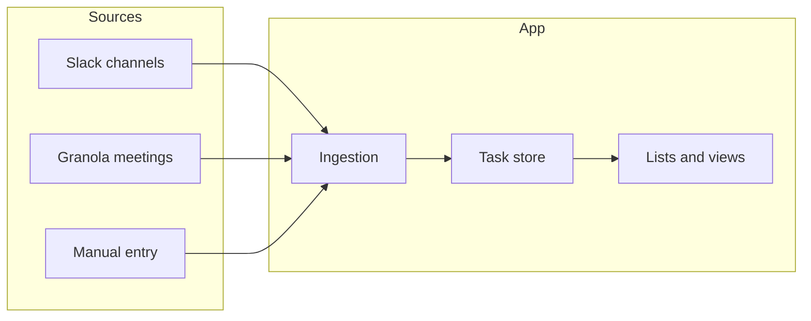

# Product Requirements Document: Personal Task Commitments App

**Version:** 1.0  
**Audience:** Personal spec (build or brief a contractor)  
**Last updated:** February 2025

---

## 1. Problem statement

As a busy product manager, I capture task commitments from many places: promises made in meetings (recorded in Granola transcripts), actionable items from Slack channels, and ideas I want to act on. I currently write most of these into a notepad by hand. The number of tasks grows faster than I can complete them, and lists spill across multiple pages. I lose items, struggle to prioritise continuously, and find it hard to plan my day or week with a single, reliable view of what I’ve committed to.

**Impact:** Overwhelm, dropped commitments, and reactive rather than planned work.

**Desired outcome:** One place that shows all my task commitments—from Slack, meetings, and my own notes—categorised and prioritised, with the ability to complete them and plan my days and weeks ahead.

---

## 2. Goals and success criteria

| Goal | Success criteria |
|------|------------------|
| Replace fragmented notepad lists | All committed tasks from Slack, Granola, and manual input can appear in the app. |
| Clear prioritisation | I can categorise tasks, set priority, and re-prioritise (e.g. drag-and-drop or move up/down). |
| Completion tracking | I can mark tasks complete and optionally review a “Done” list. |
| Day and week planning | I can assign tasks to “today” or “this week” and view lists by day/week. |
| Daily scan without losing items | I can run a daily scan (Slack + Granola) and see new items without existing tasks disappearing. |

---

## 3. User persona and context

- **Who:** Busy product manager (single user).
- **Context:** Many meetings (Granola), many Slack channels, and ad hoc ideas. Tasks are commitments (“I will do X”) or clear follow-ups, not generic “to-dos” from others.
- **Usage:** Morning review, after meetings, when checking Slack, and when capturing a quick idea. Need fast access and minimal friction to add, prioritise, and complete.

---

## 4. Data sources and ingestion

Tasks enter the app from three sources:

| Source | How it works |
|--------|--------------|
| **Slack** | Daily scan of selected channels. Fetch recent messages; use simple rules or heuristics (e.g. “I’ll …”, “Action: …”, @mentions) to suggest tasks. Store with source = Slack, channel, date, and link to message. |
| **Granola** | Use meeting notes/transcripts (API or export). Parse or tag action items (e.g. “Action: …”, “Follow up: …”). Store with source = Granola, meeting id/title, date. |
| **Manual** | In-app form: title, optional description, category, priority, due/planned date. Source = Manual. |

**Unified task model:**

| Field | Type | Description |
|-------|------|-------------|
| id | string (UUID) | Unique identifier. |
| title | string | Short description of the task. |
| description | string (optional) | Longer notes. |
| source | enum | `Slack` \| `Granola` \| `Manual`. |
| source_ref | string (optional) | Link or id to original context (e.g. Slack permalink, Granola meeting id). |
| category | string | User-defined category (default e.g. “Uncategorised”). |
| priority | enum or number | e.g. High / Medium / Low, or 1–5. |
| sort_order | number (optional) | For explicit ordering within a view. |
| status | enum | e.g. `open` \| `done`. |
| created_at | datetime | When the task was created. |
| completed_at | datetime (optional) | When marked done. |
| due_date | date (optional) | Optional due date. |
| planned_date | date (optional) | Day or week bucket for planning (e.g. “planned for today”). |
| raw_snippet | string (optional) | Short quote from source for “where did this come from?”. |

---

## 5. Core features and requirements

### 5.1 Single list of tasks

- All tasks in one store.
- Filter by: source, category, status, date range (e.g. today, this week).
- Sort by: priority, sort_order, created_at, due_date, planned_date.

### 5.2 Categorisation

- User-defined categories (e.g. by project or type: Meeting follow-up, Slack, Idea).
- Each task has exactly one category; default “Uncategorised”.
- Add, edit, archive categories; change category on any task.

### 5.3 Prioritisation and re-prioritisation

- Priority field (e.g. High / Medium / Low).
- Ability to re-prioritise: change priority and/or explicit order (e.g. drag-and-drop or move up/down).
- List views sort by priority and/or sort_order.

### 5.4 Completion

- Mark task complete (status = done, set completed_at).
- Completed tasks visible in a “Done” or “History” view.
- Main list can optionally “hide completed”.

### 5.5 Day and week planning

- Optional due_date and/or planned_date (day or week).
- Views: “Today”, “This week”, “By priority”, “By category”.
- Assign tasks to a day or week; view lists by day/week.

### 5.6 Reference and traceability

- Each task shows source (Slack / Granola / Manual) and a link or reference (e.g. Slack permalink, Granola meeting link).
- One-click or copy to open source context.

### 5.7 Daily scan

- **Trigger:** Manual “Scan now” and/or scheduled daily run (e.g. Vercel Cron).
- **Steps:** Fetch Slack (selected channels), fetch recent Granola meetings/notes; parse action items; create or suggest new tasks (e.g. “suggested” vs “confirmed” to avoid duplicates).
- **Requirement:** Running a scan must not remove or overwrite existing tasks; only add or suggest new ones.

---

## 6. User flows

- **Morning review:** Open app → see “Today” / “This week” and any new items from last scan → re-prioritise top items → optionally assign items to today.
- **After a meeting:** (In-app or from Granola) “Import from Granola” for a meeting → review suggested actions → accept and categorise/prioritise.
- **Slack-driven work:** Daily scan runs → new Slack-sourced tasks appear → user categorises, sets priority, optionally assigns to day/week.
- **Ad hoc idea:** Quick-add manual task → set category, priority, optional due/planned date.
- **Completing:** Mark task complete; optionally review “Done” list.

---

## 7. Build approach and tech stack

### 7.1 Recommended approach

- **UI:** Build the frontend with **V0** (React/Next.js components). Use it for task lists, filters, category/priority controls, add-task form, day/week views, and completion.
- **Hosting:** Deploy the Next.js app on **Vercel** (natural fit with V0).
- **Data:** Use a database for persistence—e.g. **Supabase** (Postgres) or **Vercel Postgres** / **Vercel KV** for a single-user dataset.
- **Integrations:** Implement in **Next.js API routes** (or Vercel serverless): “Sync from Slack” and “Sync from Granola” endpoints, callable from a “Scan now” button.
- **Daily scan:** Use **Vercel Cron** (e.g. in `vercel.json`) to call a protected API route once per day.

### 7.2 Phased implementation

| Phase | Scope | Outcome |
|-------|--------|--------|
| **Phase 1** | V0 UI + manual tasks only | Working app: add, categorise, prioritise, complete, day/week views; data persisted in DB. No Slack/Granola yet. |
| **Phase 2** | Slack + Granola ingestion | “Scan now” and optional daily cron; tasks from Slack and Granola appear as suggested or confirmed; link back to source. |

Start with Phase 1 to get a usable app quickly; add Phase 2 once the core loop is solid.

---

## 8. Non-functional requirements

- **Data:** Single user; one dataset. Stored in chosen DB (Supabase or Vercel).
- **Security:** No sharing of data. Slack and Granola credentials in env vars or secure config; not exposed to client.
- **Performance:** List and filters should feel instant (e.g. &lt; 200 tasks without pagination in v1). Scan can run in background.

---

## 9. Out of scope / v2

- Multi-user, teams, or sharing.
- Native mobile apps (web + optional PWA is in scope).
- AI auto-categorisation or auto-priority (v1 = user-driven).
- Full two-way sync (e.g. posting back to Slack); v1 = read-only ingestion from Slack and Granola.
- Calendar integration.

---

## 10. Appendix

### 10.1 Platform recommendation

- **Web app first**, responsive so it works on phone/tablet. Optional **PWA** for installable, app-like access.
- Single codebase, easy to host on Vercel; Slack and Granola integrations are straightforward from Next.js API routes or serverless.

### 10.2 Integration references

- **Slack:** Slack API for channel list, channel history (messages). Use Bot or User token with appropriate scopes (e.g. `channels:history`, `groups:history` if private channels).
- **Granola:** Granola API or export for meeting notes/transcripts; endpoints for listing meetings and retrieving content (see Granola API docs for exact endpoints and auth).

---

*End of PRD*
